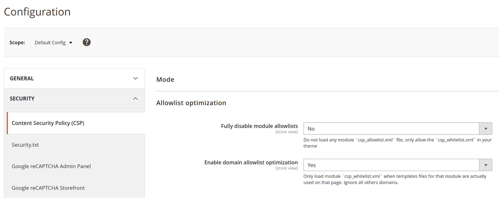

# Content Security Policy Optimized Allowlist
Greatly reduce or fully disable loading of `csp_whitelist.xml` files that are included in (default) extensions.

## Description
The CSP header `Content-Security-Policy` contains a list of allowed domains which are to both your frontend and backend of your Magento installation and no validation is done if these domains are actually needed to run a page. This brings certain security risks as it can be used to trigger some clever XSS attacks (more below) on your store.

Even if CSP if fully enforced, `eval` and unsigned `inline` scripts are disabled, it still will be possible to inject non validated code to run on your store.

Your Magento installation will include many third party extensions and Magento also ships some `csp_whitelist.xml` files per default, all files include many domains.
These domains will automatically be merged into the CSP header. Besides for the additional risks this greatly increases the size of the CSP header.
## Installation
Installation in your Magento project is done via composer.

```shell
composer require hyva-themes/magento2-optimized-csp-allowlist
bin/magento setup:upgrade
```

## Post installation
This extension can run in two modes, fully disable all modules `csp_whitelist.xml` or check if a template file from a specific extension is used,
only if a `.phtml` file from an installed extension is used it will include in the CSP header.

The first option is the safest, you can still include a `csp_whitelist.xml` file directly in your theme. After installation the second option is enabled per default.

Checking if an `.phtml` is used and only loading those allowlist XML files is enabled by default.
## Configuration
You can configure how the extension should work per store, if you have a storeview and get some weird.

- Navigate to **Stores** -> **Configuration**
- Then **Security** -> **Content Security Policy (CSP)**
  - **Fully disable module allowlists** to fully disable modules `csp_whitelist.xml`'s (default: **No**)
  - **Enable allowlist optimization** to enable or disable the setting per store (default: **Yes**)



## Research: XSS Risks when allowing domains
On a vanilla Magento (tested 2.4.8-p1) installation without this feature, 25 of the 46 items on the allowed domains list can be used
to inject XSS.

An example as `*.google.com` is whitelisted in the `magento/module-payment-services-paypal/etc/csp_whitelist.xml` which allows at least the following possible injection.

```html
<script src="https://accounts.google.com/o/oauth2/revoke?callback=alert(1337)"></script>
```

This input is reflected on the endpoint and therefore it will trigger `alert(1337)`, this can become anything.

More information about this, take a look at [renniepak/CSPBypass](https://github.com/renniepak/CSPBypass) and test your own domains.
## Technique
The extension checks wetter a `.phtml` file is loaded within an extension, if this is true, the extension will be allowed to load it's whitelist.
## Adding domains and hashes without XML
Use ViewModel  `\Hyva\OptimizedCspAllowlist\ViewModel\Hosts::add(string $policyId, ['host.ext', ...])` to add domains without the use of `csp_whitelist.xml`.

This gives more flexibility as you can be very specific in which domains and/or hashes you want to load in the frontend.

The GA code for instance could include registration of the domain in the same file, making sure that only that unique script can be loaded on the site.
### Dynamic domains
It is also possible to add custom domains, for instance when using multilingual domains, no more `*.host.ext` but allow `lang.host.ext` instead.
### Viewmodel example default
This example can be used in any situation with any theme.
```xml
<!-- ... snap ... -->
<block ...>
  <arguments>
    <argument name="view_model" xsi:type="object">\Hyva\OptimizedCspAllowlist\ViewModel\Hosts</argument>
  </arguments>
</block>
<!-- ... /snap ... -->
```

```php
<?php
// .. snap
$viewModel = $block->getViewModel();
$viewModel->add('script-src', 'https://*.host.ext')
// .. /snap
```

### Example when using Hyva Themes
In Hyva the the viewmodel registry `$viewModels` can be used to load the correct Viewmodel.

```php
<?php
// .. snap
$viewModel = $viewModels->require(\Hyva\OptimizedCspAllowlist\ViewModel\Hosts::class);
$viewModel->add('script-src', 'https://*.host.ext')
// .. /snap
```


## Notes
During research I ran into some miss configurations in default Magento extensions, for instance. google-analytics.com is whitelisted in the adwords extension.
Enabling google analytics in the backend will not add the header for GA, this is because the domain is registered in the google adwords extension. 🤷

## Copyright
[Hyvä Themes](https://hyva.io/) 2025-
## Author
- [Jeroen Boersma](https://www.github.com/JeroenBoersma)
